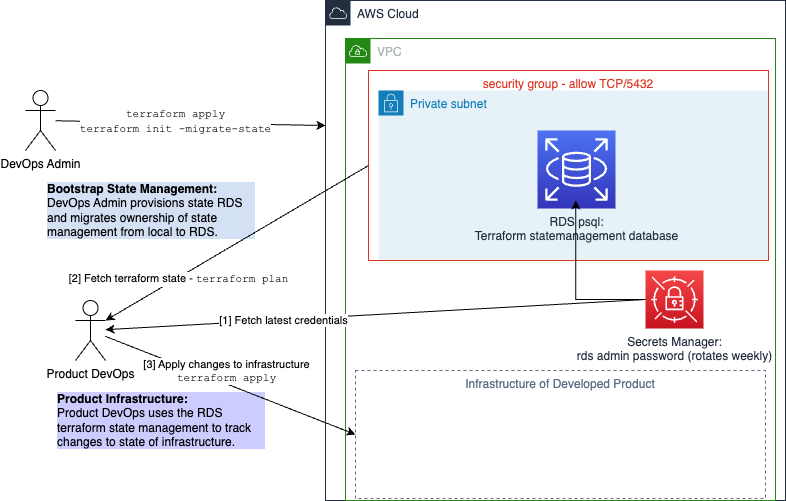

# Terraform State Backend - RDS PostgreSQL

This terraform project will bootstrap setting up an RDS PostgreSQL instance in 
a target AWS account using a local backend. 

We will then setup another example terraform project which will use this RDS instance as the terraform state management backend for that environment.

We will deploy the same setup to 3 distinct AWS accounts each with their own isolated state management.

We should also be able to cleanly teardown the whole setup.



<!--TOC-->

- [Terraform State Backend - RDS PostgreSQL](#terraform-state-backend---rds-postgresql)
  - [Structure](#structure)
  - [Achitecture Diagram](#achitecture-diagram)
  - [Quickstart](#quickstart)
    - [Setup the tfvars](#setup-the-tfvars)
    - [Python Scripts](#python-scripts)

<!--TOC-->

## Structure

```
.
├── deployments
│   ├── dev
│   │   ├── backend.tf
│   │   ├── main.tf
│   │   ├── outputs.tf
│   │   └── variables.tf
│   ├── prd
│   │   ├── backend.tf
│   │   ├── main.tf
│   │   ├── outputs.tf
│   │   └── variables.tf
│   └── uat
│       ├── backend.tf
│       ├── main.tf
│       ├── outputs.tf
│       └── variables.tf
├── modules
│   └── state_backend_rds
│       ├── main.tf
│       ├── outputs.tf
│       └── variables.tf
├── poetry.lock
├── pyproject.toml
├── tasks.py
└── terraform.tfvars.example
```

## Achitecture Diagram


## Quickstart

### Setup the tfvars

You will want to copy `terraform.tfvars.example` into each of:
 - `deployments/dev/terraform.tfvars`
 - `deployments/uat/terraform.tfvars`
 - `deployments/prd/terraform.tfvars`

And modify the values accordingly:

`terraform.tfvars`

```sh
environment = "dev"
aws_profile = "my-dev-aws-profile"
team = "hobbyprojects"
project = "tf-backend-bootstrap"
```

### Python Scripts

We are using `invoke` to help automate some of the more verbose scripts.

```sh
poetry install
poetry shell
invoke --list

Available tasks:

  tf               Standardised terraform command runner for multiple environment states.
  tffmt            Standardised terraform formatter for multiple environment states.

  init             Initialise Terraform for the given deployment enviroment.
  plan             Plan Terraform state change for the given deployment enviroment.
  apply            Apply Terraform state change for the given deployment enviroment.
  destroy          Apply Terraform state change for the given deployment enviroment.

  conn-str         Generate the current connection string to the database.
  create-backend   Create a backend block for the target deployment environment.
  migrate-state    Migrate Terraform state to a new provider.
  remove-backend   Remove a backend block for the target deployment environment.

  bootstrap        Bootsrap an environment.
  teardown         Tear down and clean up the whole project.
```

Some example usage:

```sh
inv init dev
inv plan dev
inv apply dev
inv conn-str dev
eval "$(inv conn-str dev)"
inv 

inv destroy
```

The same applies for `dev`, `uat`, `prd`.

The specifics are located in `tasks.py`